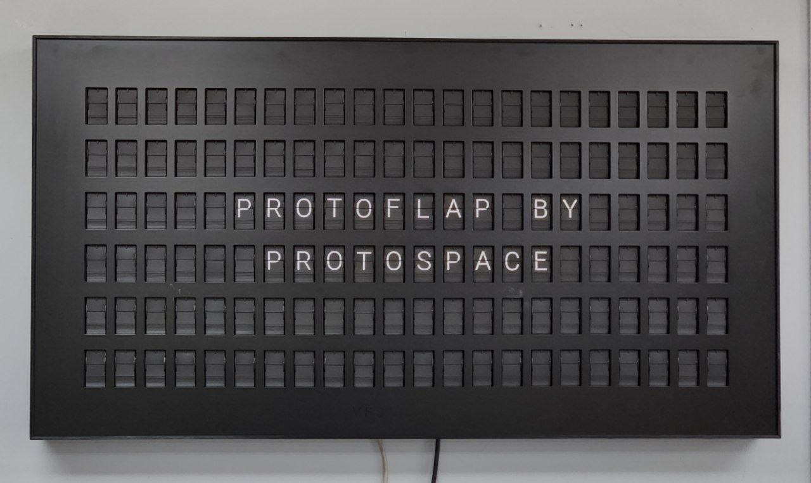

# Protoflap

Controls the welcome room Vestaboard directly, bypassing their cloud.



## Theory

Polls URL (https://api.my.protospace.ca/stats/) continuously and looks for
changes to the `vestaboard` key. When updated, it replaces any special
characters and then displays the message on the sign via serial.

If you want to use this, just call `send_sign(text)` in protoflap.py directly.

The split flap controller is connected to serial at `/dev/ttyAMA0`, 38400 baud.

### See Also

@Benno1308's reverse engineering:

https://github.com/EngineOwningSoftware/Vestaboard-Reverse-Engineering

https://www.reddit.com/r/Vestaboard/comments/tjm93n/local_device_api/

## Setup

Download the Vestaboard root private key. It should be the same for all
Vestaboards:

```
$ curl https://files.catbox.moe/kvibj6 > ~/.ssh/vestaboard
$ chmod 600 ~/.ssh/vestaboard
```

SSH into the Vestaboard using the root key, ie:

```
$ ssh -i ~/.ssh/vestaboard root@10.139.85.133
```

### Script

Clone the script:

```
# git clone https://github.com/Protospace/protoflap.git
```

Test it:

```
# cd protoflap/
# python protoflap.py
```

### Supervisor

To run the script automatically, install supervisor:

```
# apt install supervisor
# touch /etc/supervisor/conf.d/protoflap.conf
# vim /etc/supervisor/conf.d/protoflap.conf
```

Set config to:

```
[program:protoflap]
user=root
directory=/root/protoflap
command=/usr/bin/python -u /root/protoflap/protoflap.py
stopsignal=INT
stopasgroup=true
killasgroup=true
autostart=true
autorestart=true
stderr_logfile=/var/log/protoflap.log
stderr_logfile_maxbytes=10MB
stdout_logfile=/var/log/protoflap.log
stdout_logfile_maxbytes=10MB
```

Load changes:

```
# supervisorctl reread; supervisorctl update
# supervisorctl status
```

